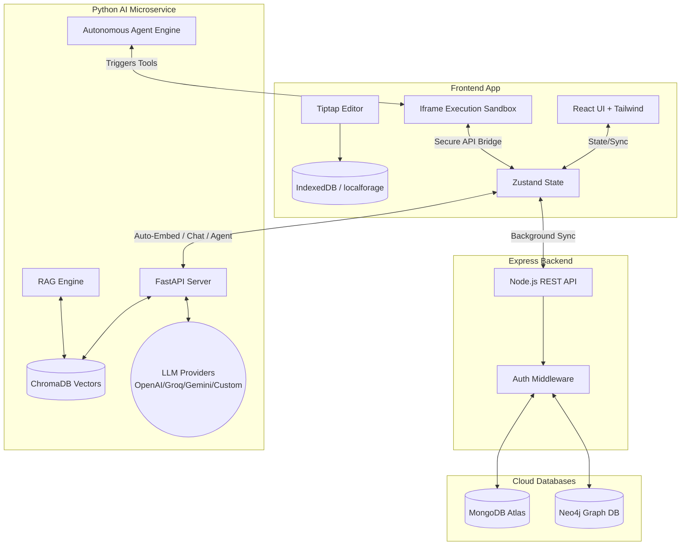
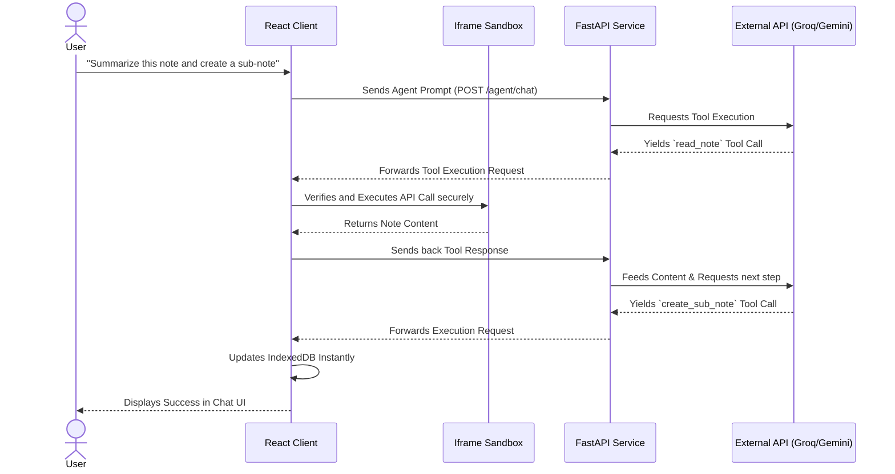
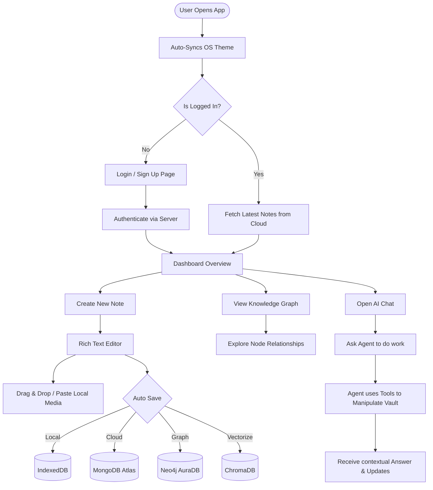

# 🌿 NoteRootAI

NoteRootAI is a state-of-the-art, local-first, AI-powered Knowledge Management System (KMS) inspired by Notion and Obsidian. It is designed to act as your second brain, offering a rich markdown editor, interactive knowledge graph visualization, offline-first capabilities with cloud synchronization, and a deeply integrated AI assistant capable of contextual Retrieval-Augmented Generation (RAG) and autonomous agentic workflows.

---

## 📖 Table of Contents
1. [What is NoteRootAI?](#-what-is-noterootai)
2. [Architecture](#-architecture)
3. [Modules & File Structure](#-modules--file-structure)
4. [Data Flow Diagram (DFD)](#-data-flow-diagram-dfd)
5. [User Flow](#-user-flow)
6. [Features](#-features-added-so-far)
7. [Plugin Ecosystem](#-plugin-ecosystem)
8. [What Needs to be Added](#-what-needs-to-be-added)
9. [How to Start & Use the Project](#-how-to-start--use-the-project)

---

## 🎯 What is NoteRootAI?

NoteRootAI bridges the gap between traditional note-taking apps and advanced AI research tools. 
- **Offline-First:** All notes and media are saved instantly to your local browser using IndexedDB, allowing you to write without an internet connection.
- **Knowledge Graph:** Like Obsidian, your notes are visually connected in a graph. Typing `[[Note Title]]` automatically forms a relationship mapped in Neo4j.
- **AI RAG & Autonomous Agent:** An embedded AI service automatically chunks and vectorizes your notes. You can chat with your knowledge base, or empower the AI Agent to autonomously execute tools to create, read, append, update, and organize your vault for you!
- **Bring Your Own Key (BYOK):** Supports OpenAI, Anthropic, Gemini, Mistral, Groq, and entirely custom OpenAI-compatible local endpoints (like Ollama or OpenRouter) natively out of the box.

---

## 🏗️ Architecture

NoteRootAI is built on a robust three-tier architecture ensuring separation of concerns:
1. **Client (Frontend):** React + Vite, Tailwind CSS, Tiptap (Editor), Cytoscape (Graph), Zustand (State), and a secure Iframe Sandbox for Plugin/Agent execution.
2. **Server (Backend Core):** Node.js + Express, MongoDB Atlas, Neo4j, Socket.io.
3. **AI Service (Microservice):** Python FastAPI, ChromaDB (Local Vector DB).



---

## 📂 Modules & File Structure

The project uses a monorepo-style structure separated into three main services:

```text
d:\NoteRoot2\
├── client/                     # Frontend React Application
│   ├── src/
│   │   ├── components/         # UI Components (Editor, Layout, Sidebar)
│   │   ├── pages/              # Route Pages (Dashboard, Graph, Chat)
│   │   ├── stores/             # Zustand State (noteStore, authStore, settingsStore)
│   │   └── lib/                # Configs, API connections, Plugin Bridge
│   └── package.json
│
├── server/                     # Node.js + Express API Backend
│   ├── src/
│   │   ├── controllers/        # Business logic (noteController)
│   │   ├── models/             # Mongoose schemas (Note)
│   │   ├── routes/             # Express API routes
│   │   ├── neo4j.ts            # Graph database driver initialization
│   │   └── app.ts              # Express Server setup
│   └── package.json
│
└── ai-service/                 # Python FastAPI AI Microservice
    ├── providers/              # LLM factory (OpenAI, Gemini, Anthropic, Custom)
    ├── services/               # RAG, Embedding, Agent Tool definitions
    ├── chroma_db/              # Local persistent vector database
    ├── main.py                 # FastAPI endpoints
    └── requirements.txt
```

---

## 🔄 Data Flow Diagram (DFD)

This diagram explains how data moves through the system when a user interacts with the Autonomous Agent.



---

## 🚶 User Flow



---

## ✨ Features Added So Far

### Phase 1: Core KMS Foundation (100% Complete)
- **Modern UI:** Resizable 3-pane layout, smart automatic OS theme syncing, manual dark/light mode toggle, OKLCH color palettes.
- **Rich Editor (Tiptap):** 
  - Slash command `/` menu for easy block insertion.
  - Floating bubble menu for text formatting.
  - Drag-and-Drop and Clipboard Paste support for local Images (instantly saved natively without external buckets).
  - Table context toolbar for row/col management.
  - Math (KaTeX) and Mermaid diagram support.
- **Knowledge Graph:** Interactive visual graph using Cytoscape.js. Typing `[[Note Title]]` automatically links nodes in the Neo4j database.
- **Offline-First Sync:** Edits save instantly to local storage (`localforage`). A robust background queue syncs changes, including local deletions, to the cloud server gracefully.
- **Authentication:** Secure user login and signup to sync notes across multiple devices.

### Phase 2: AI Engine & RAG (100% Complete)
- **BYOK (Bring Your Own Key):** Dynamic factory supporting multiple built-in providers (Gemini, OpenAI, Anthropic, Mistral, Groq).
- **Custom Local LLMs:** Easily add any OpenAI-compatible API (Ollama, OpenRouter, etc.) and specify custom models dynamically.
- **Auto-Embedding Pipeline:** Background task that chunks your notes and indexes them in a local ChromaDB instance without interrupting your typing.
- **Semantic Retrieval:** Suggests related notes based on semantic similarity.
- **Contextual Chat:** Fully streaming AI chat that automatically references your personal vault context.

### Phase 3: Autonomous Agent & Extensibility (100% Complete)
- **Agentic Workflow:** The AI can now act as an autonomous agent, equipped with a suite of backend tools to actively manage your vault.
- **Vault Manipulation Tools:** The agent can dynamically `list_all_notes`, `read_note`, `create_note`, `create_sub_note`, `update_note`, `append_to_note`, and `delete_note`.
- **Smart Note Resolution:** Agent tools feature case-insensitive fallback logic, enabling it to look up notes by both exact ID or natural Language Title automatically.
- **Secure Sandbox Bridge:** Plugin & Agent code is executed securely using an isolated Iframe Sandbox that safely bridges validated API calls back to the main thread `zustand` store.
- **Smart Formatting:** Automatic interception and conversion of Agent Markdown outputs into complex TipTap HTML blocks for perfect rendering.

---

## 🧩 Plugin Ecosystem

NoteRootAI features a first-class plugin system that allows the community to extend the editor, AI capabilities, and UI.

### How Plugins Work

Plugins are single JavaScript files hosted on public GitHub repositories. They are loaded and executed by the **Plugin Runtime** in a locked-down scope — no `window`, no `document`, no DOM access. Every interaction goes through a safe, typed `ctx` API.

```javascript
// Every plugin follows this structure
function main(ctx) {
  const { runtime, notes, ui, ai, theme, settings, events } = ctx;

  // Register extensions into UI slots
  runtime.registerExtension('note.pageActions', {
    id: 'my-action',
    icon: '⚡',
    label: 'My Action',
    onClick: async (noteId) => {
      const note = await notes.getNote(noteId);
      ui.showToast(`Note has ${note.title.length} chars in title!`);
    }
  });
}
```

### Available Extension Points

| Extension Point | Where It Appears |
|---|---|
| `settings.panels` | Settings → Plugins |
| `note.pageActions` | Note editor top-right toolbar |
| `editor.bubbleButtons` | Text selection bubble menu |
| `editor.slashItems` | `/` command menu |
| `layout.modals` | Modal dialogs |
| `layout.overlays` | Always-visible overlays |
| `theme.tokens` | App-wide CSS variable overrides |

### Plugin Repository Examples

| Plugin | Description |
|---|---|
| [`sample-plugin/`](./sample-plugin/) | Official reference plugin — demonstrates all extension points |
| [`summarizer-plugin/`](./summarizer-plugin/) | Real-world plugin — summarizes selected text using `ctx.ai.chat()` |

### 📚 Plugin Developer Guide

See the **[`docs/`](./docs/)** folder for the complete multi-page developer guide:

- [What Are Plugins?](./docs/01-what-are-plugins.md) — Architecture & security model
- [Installation Guide](./docs/02-installation.md) — How to install from GitHub or locally
- [Creating Your First Plugin](./docs/03-creating-your-first-plugin.md) — Step-by-step tutorial
- [Extension Points Reference](./docs/04-extension-points.md) — All 7 extension points
- [Plugin Context API](./docs/05-plugin-context-api.md) — Full `ctx` API reference
- [Declarative UI System](./docs/06-declarative-ui.md) — All DescriptorNode types
- [Publishing & Marketplace](./docs/07-publishing.md) — How to publish your plugin
- [Examples & Recipes](./docs/08-examples.md) — Copy-paste patterns for common use cases

---

## 🚀 What Needs to be Added

We are currently preparing to build **Phase 4 (Community Ecosystem)**.
- **Community Plugins:** Extending the Iframe sandbox to allow users to load community-developed JS plugins directly into their workspace.
- **Marketplace UI:** A visual settings panel to browse, install, and manage plugins and community themes.
- **Custom Importers/Exporters:** First-party tools to seamlessly import Markdown folders, Obsidian Vaults, or Notion backups.
- *Minor Refactors:* Upgrade from deprecated `google.generativeai` to `google.genai` SDK in the AI service, and move hardcoded API URLs to `.env` configs.

---

## 🛠️ How to Start & Use the Project

### Prerequisites
- Node.js (v18+)
- Python (3.10+)
- MongoDB Atlas account (for document storage)
- Neo4j AuraDB account (for graph storage)

### 1. Start the Express Backend (Server)
1. Open a terminal and navigate to `server/`:
   ```bash
   cd server
   npm install
   ```
2. Create a `.env` file in the `server` directory containing your `MONGODB_URI` and `NEO4J_URI`, `NEO4J_USER`, `NEO4J_PASSWORD`.
3. Start the dev server:
   ```bash
   npm run dev
   ```
*(Runs on `http://localhost:5000`)*

### 2. Start the AI Microservice
1. Open a new terminal and navigate to `ai-service/`:
   ```bash
   cd ai-service
   ```
2. Create a virtual environment and install dependencies:
   ```bash
   python -m venv venv
   # Windows: venv\Scripts\activate
   # Mac/Linux: source venv/bin/activate
   pip install -r requirements.txt
   ```
3. Start the FastAPI server:
   ```bash
   uvicorn main:app --reload
   ```
*(Runs on `http://localhost:8000`)*

### 3. Start the React Frontend (Client)
1. Open a third terminal and navigate to `client/`:
   ```bash
   cd client
   npm install
   ```
2. Start the Vite development server:
   ```bash
   npm run dev
   ```
*(Runs on `http://localhost:5173`)*

### Using NoteRootAI
1. Navigate to `http://localhost:5173` in your browser.
2. Sign up or log in to a new account.
3. Click "New Note", give it a title, and use `/` to see all formatting options. You can also paste or drop images instantly.
4. Go to Settings > AI Providers, enter your preferred API key (e.g., Gemini or Groq) or setup a Custom Ollama endpoint.
5. Open the right sidebar to start chatting with your Agent to automatically build, retrieve, or organize your knowledge base!
